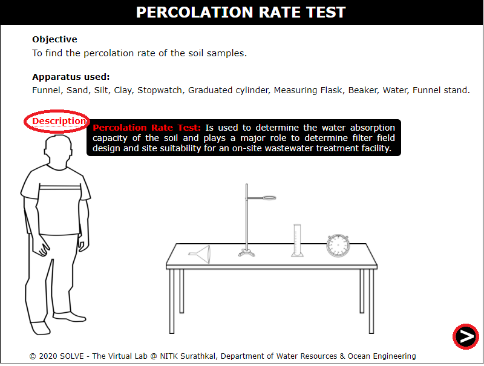
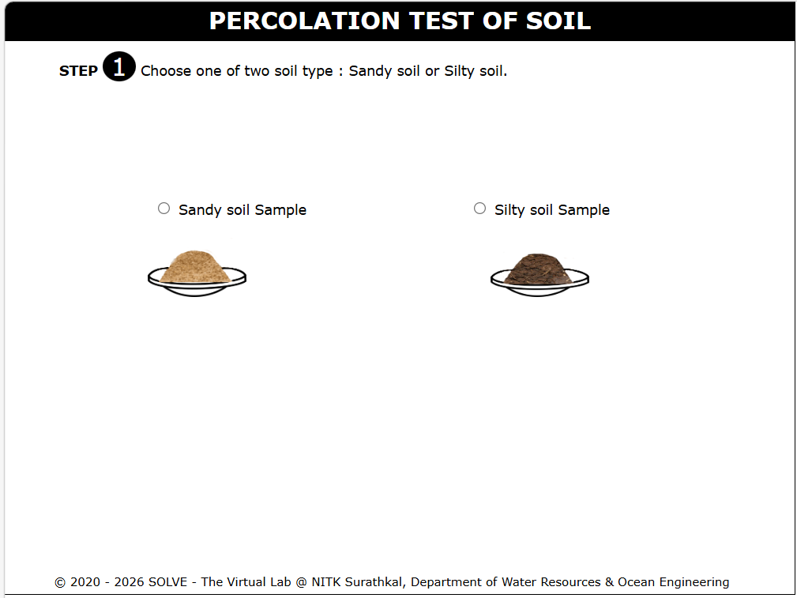
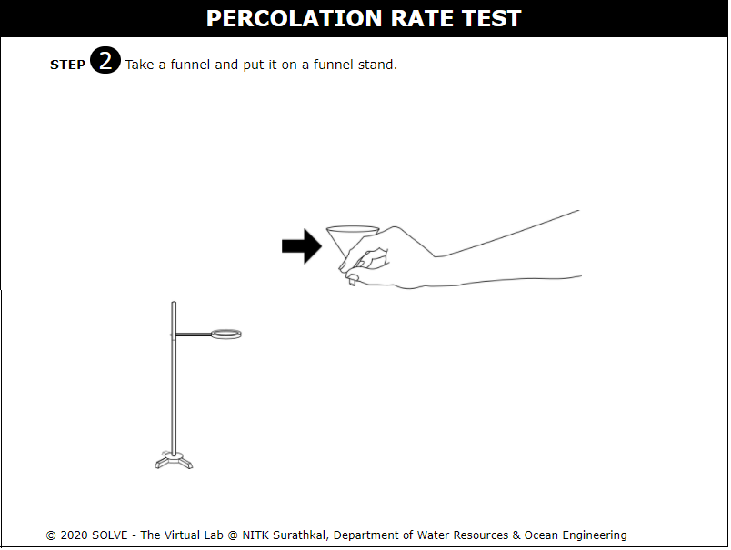
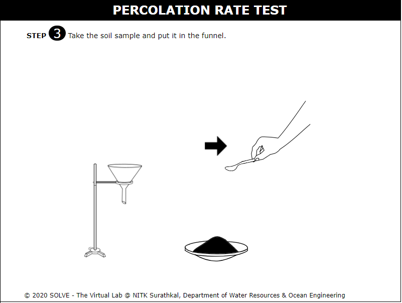
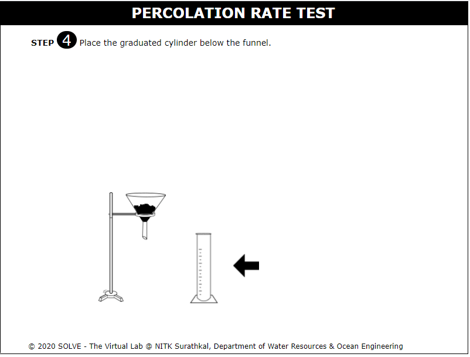
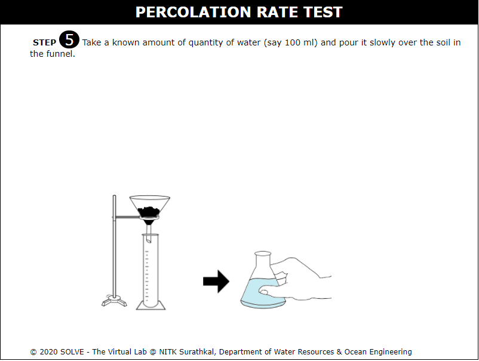
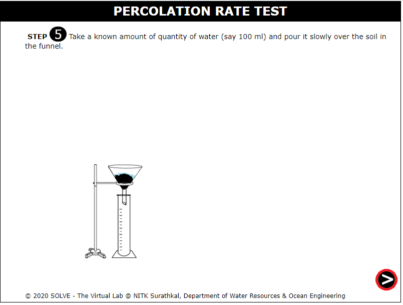
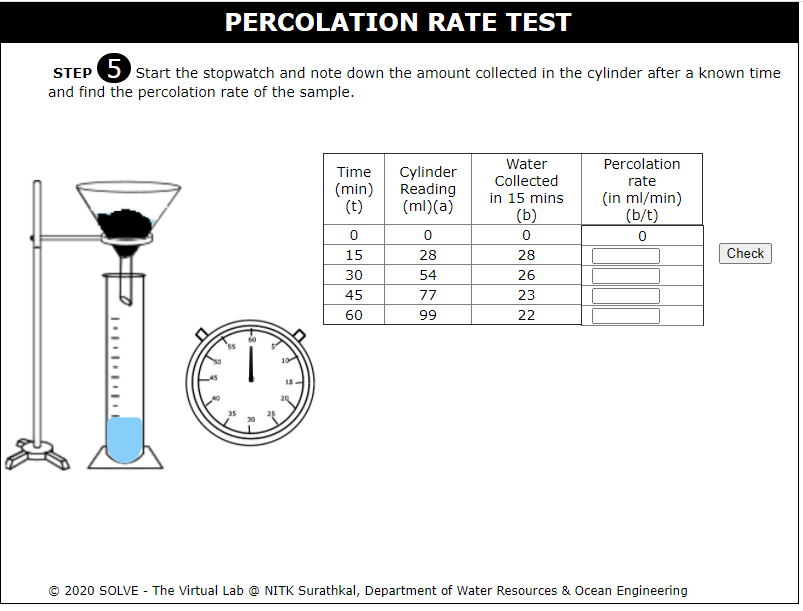

##### These procedure steps will be followed on the simulator

1. When you click on the Percolation Rate Test file, a new window will open as shown below. 
 

2. Choose one of the two types of soil: silty soil or sandy soil. 
 

3. Click on the funnel to place it on the funnel stand.  
 

4. Click on the spatula to add the soil sample into the funnel. Then click on the NEXT button. 
 

5. Click on the graduated cylinder to place it below the funnel. 
 

6. Take a known quantity of water (e.g., 100 ml) and pour it slowly over the soil in the funnel. Click on the NEXT button to proceed. 
 

7. Start the stopwatch and note the amount of water collected in the cylinder after a known time. Then click on the CHECK button to calculate the percolation rate. 
 

8. Click on the CHECK button to calculate the average percolation rate. 
 

9. The final result will be displayed below. 
 

