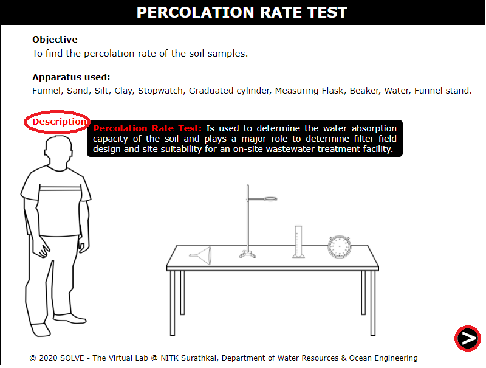
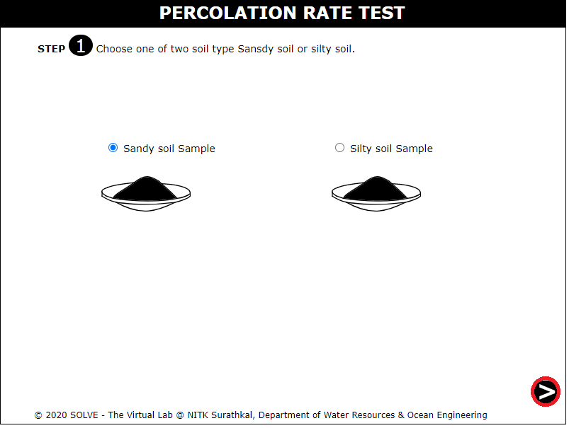
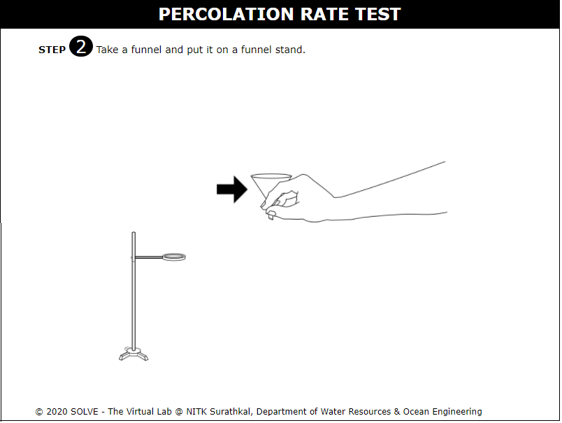
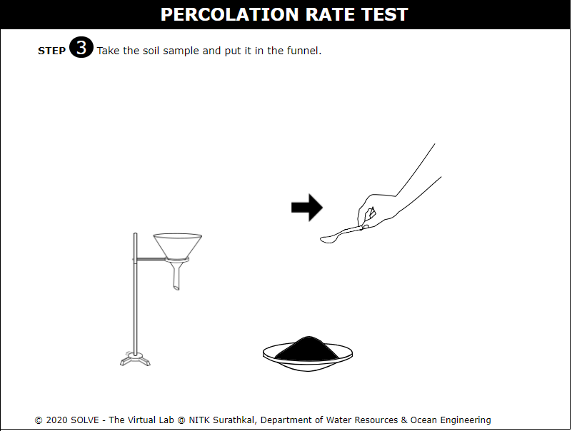
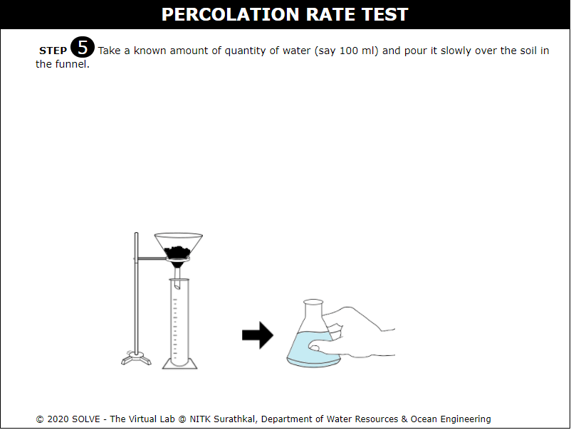
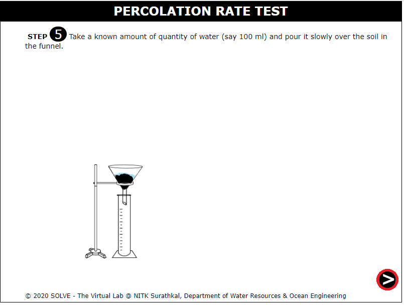
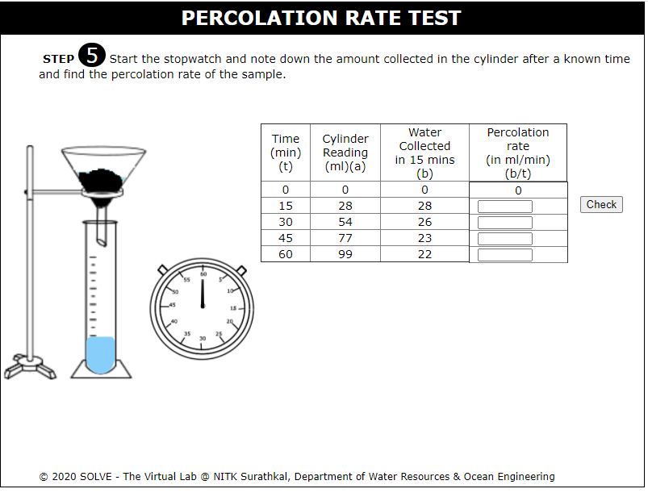

##### These procedure steps will be followed on the simulator

1. When you click on a Percolation rate test file, a new window will open as shown below. 
 

2. Choose one of two type of soil  silty soil or sandy soil. 
 

3. Click on the funnel to put it on the funnel stand.  
 

4. Click on the spatula to put the soil sample to funnel. Click on NEXT BUTTON. 
 

5. Now click on the graduated cylinder to place it below the funnel. 
 

6. Now Take a known quantity of water (say 100 ml) and pour it slowly over the soil in the funnel. Click on the NEXT BUTTON to proceed further. 
 

7. Start the stopwatch and note down the amount collected in the cylinder after a known time and click on the CHECK button to calculate the percolation rate. 
 

8. Now click on the CHECK button to calculate the Average Percolation Rate. 
 

9. Now final result will be displayed below. 
 

